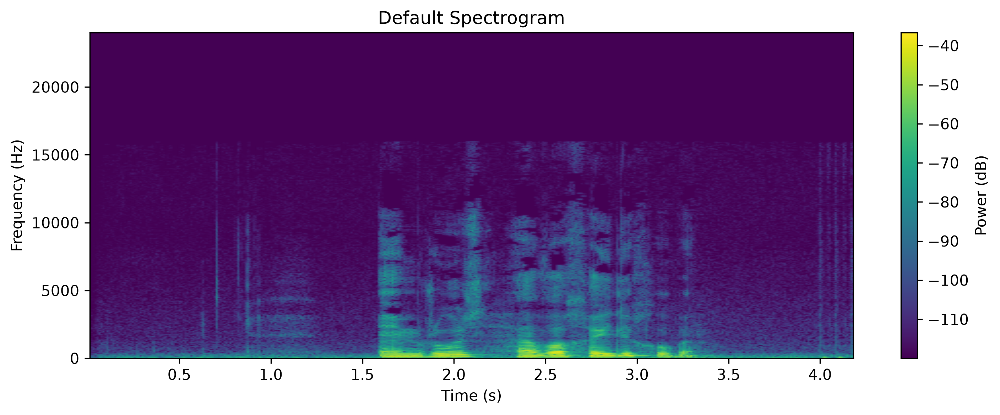
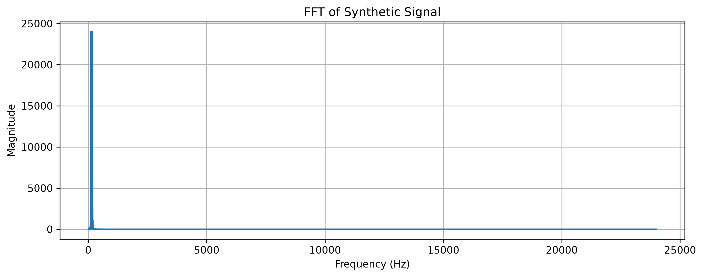
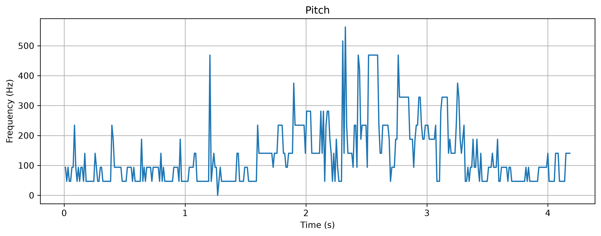

# Pitch Analysis

A Digital Signal Processing (DSP) project for analyzing recorded speech and synthetic signals using Fourier Transform (FFT), Spectrogram, and Pitch Estimation.

---

## Project Overview

This project implements the required tasks of the DSP course assignment. Recorded speech signals and synthetic signals are analyzed in both the frequency and time-frequency domains.

The project includes:

- Spectrogram analysis
- FFT analysis
- Synthetic signal generation
- Pitch estimation

---

## Project Structure

```text
pitch-analysis/
├── data/
│   └── recorded/
│       ├── question.wav
│       ├── statement.wav
│       ├── sustained_ah.wav
│       ├── sustained_ee.wav
│       └── sustained_oo.wav
│
├── outputs/
│   ├── fft/
│   ├── pitch/
│   └── spectrograms/
│
├── src/
│   ├── analysis.py
│   ├── audio.py
│   ├── pitch.py
│   └── visualization.py
│
├── main.py
├── requirements.txt
├── README.md
└── .gitignore
```

---

## Requirements

- Python 3.12+
- NumPy
- SciPy
- Matplotlib
- Librosa
- SoundFile

Install the required packages:

```bash
pip install -r requirements.txt
```

---

## Running the Project

Run the project with:

```bash
python main.py
```

All generated figures are automatically saved in the `outputs` directory.

---

# Implemented Tasks

## 1. Spectrogram Analysis

A recorded speech signal is analyzed using a spectrogram.

The following parameters are investigated:

- Window Length
- Window Overlap
- Window Type

Window functions used:

- Boxcar
- Hann
- Hamming

### Effect of Spectrogram Parameters

- Increasing the window length improves frequency resolution but decreases time resolution.
- Increasing the overlap produces smoother spectrograms while increasing computational cost.
- Different window types mainly affect spectral leakage while preserving the overall frequency content.

---

## 2. Frequency Analysis

Synthetic signals are generated and analyzed using the Fast Fourier Transform (FFT).

Generated signals:

- Sinusoidal signal
- Square wave
- Triangle wave

For each signal, the project computes:

- FFT
- Spectrogram

---

## 3. Pitch Estimation

Pitch estimation is performed for all recorded speech files:

- statement.wav
- question.wav
- sustained_ah.wav
- sustained_ee.wav
- sustained_oo.wav

The estimated pitch contour is automatically plotted and saved.

---

# Output Files

The generated figures are stored in:

```text
outputs/
├── fft/
├── pitch/
└── spectrograms/
```

---

## Sample Results

### Spectrogram



### FFT



### Pitch Estimation



---

## Recorded Dataset

The project uses five recorded speech samples.

| File | Description |
|------|-------------|
| statement.wav | Declarative sentence |
| question.wav | Interrogative sentence |
| sustained_ah.wav | Sustained vowel /a/ |
| sustained_ee.wav | Sustained vowel /i/ |
| sustained_oo.wav | Sustained vowel /u/ |

---

## Technologies

- Python
- NumPy
- SciPy
- Matplotlib
- Librosa

---

## Summary

This project demonstrates fundamental speech signal processing techniques, including spectrogram analysis, frequency analysis using FFT, synthetic signal generation, and pitch estimation. All generated figures are automatically saved for further inspection.